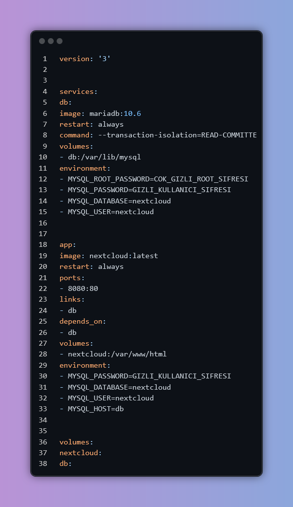

# Oracle Cloud Üzerinde Docker ile Kişisel Nextcloud Kurulumu

Bu doküman, **Oracle Cloud Infrastructure (OCI)** üzerinde **Docker** kullanarak **Nextcloud** adlı kişisel bulut depolama ve işbirliği platformunun adım adım kurulumunu anlatmaktadır.

---

## 1. Projenin Amacı

Bu projenin amacı, birden fazla cihaz (masaüstü, dizüstü, mobil) arasında **dosya senkronizasyonu ve uzaktan erişim** için **üçüncü taraf bulut servislerine alternatif**, **güvenli ve kişisel** bir sistem kurmaktır.

Açık kaynaklı bir platform olan **Nextcloud** sayesinde, tüm veri kontrolü ve gizlilik tamamen kullanıcının elinde bulunur.

---

## 2. Kullanılan Teknolojiler

| Bileşen | Kullanılan Teknoloji |
| --- | --- |
| **Bulut Sağlayıcı** | Oracle Cloud Infrastructure (OCI) Free Tier |
| **İşletim Sistemi** | Ubuntu 22.04 LTS |
| **Konteynerleştirme** | Docker & Docker Compose |
| **Uygulama** | Nextcloud |
| **Veritabanı** | MariaDB |
| **Güvenlik Duvarı** | UFW & OCI Security Lists |

---

## 3. Altyapının Kurulumu ve Yapılandırılması

### 3.1. Oracle Cloud Sanal Makine Kurulumu

OCI’ın **Her Zaman Ücretsiz (Always Free)** katmanı kullanılarak bir sanal makine (VM) oluşturuldu. Seçilen ayarlar:

- **Shape:** `VM.Standard.E2.1.Micro` veya `VM.Standard.A1.Flex`
- **Image:** Ubuntu 22.04
- **Ağ:** Gerekli VCN ve Public Subnet oluşturuldu.
- **Erişim:** SSH anahtar tabanlı güvenli erişim sağlandı.

---

### 3.2. Sunucu Hazırlığı ve Güvenlik Ayarları

Sunucuya ilk SSH bağlantısından sonra temel sistem güncellemeleri ve güvenlik adımları uygulandı:

###  1. Sistem Güncellemesi

`sudo apt update && sudo apt upgrade -y`

###  2. Yeni Sudo Yetkili Kullanıcı Oluşturma

`adduser yeni_kullanici`

`usermod -aG sudo yeni_kullanici`

###  3. UFW Güvenlik Duvarı Ayarları

`sudo ufw allow OpenSSH`

`sudo ufw allow 80/tcp`

`sudo ufw allow 443/tcp`

`sudo ufw enable`

---

### 3.3. Docker ve Docker Compose Kurulumu

`# Gerekli bağımlılıkları yükleyin`

`sudo apt install ca-certificates curl gnupg`

`# (Docker'ın resmi deposundan kurulum adımları uygulanır)`

`# Docker'ı sudo olmadan kullanmak için mevcut kullanıcıyı docker grubuna ekleyin`

`sudo usermod -aG docker ${USER}`

---

## 4. Nextcloud Uygulamasının Dağıtımı

### 4.1. `docker-compose.yml` Dosyasını Hazırlama

---

### 4.2. Konteynerleri Başlatma

docker compose up -d

Bu komut gerekli Docker imajlarını indirir, **Nextcloud** ve **MariaDB** konteynerlerini oluşturur ve başlatır.

---

## 5. Ağ ve Güvenlik Yapılandırması

Uygulamanın dışarıdan erişilebilir olması için iki katmanlı bir güvenlik yapılandırması yapılır:

1. **Sunucu Güvenlik Duvarı (UFW)**
    
    `sudo ufw allow 8080/tcp`
    
2. **Oracle Cloud Security List**
    
    OCI konsolu üzerinden VCN’e bağlı Security List’e, `0.0.0.0/0` kaynağından gelen **TCP 8080** trafiğine izin veren bir **Ingress Rule** eklendi.
    

---

## 6. Karşılaşılan Sorunlar ve Çözümler

### SSH Erişim Sorunu

**Sorun:** Yeni kullanıcıyla SSH bağlantısı yapılamadı.

**Neden:** `~/.ssh/authorized_keys` dosyası eksikti.

**Çözüm:**

`sudo cp /home/ubuntu/.ssh/authorized_keys /home/yeni_kullanici/.ssh/`

`sudo chown yeni_kullanici:yeni_kullanici /home/yeni_kullanici/.ssh/authorized_keys`

`sudo chmod 600 /home/yeni_kullanici/.ssh/authorized_keys`

---

### Web Arayüzüne Erişim Sorunu

**Sorun:** Konteynerler çalışıyor ancak web arayüzüne erişilemiyor.

**Neden:** 8080 portu UFW ve OCI Security List tarafından engellenmişti.

**Çözüm:** Her iki katmanda da 8080 portuna izin verildi.

---

### Sunucu Yanıt Vermiyor

**Sorun:** Nextcloud arayüzünden yapılan işlem sonrasında sistem kaynakları tükendi.

**Çözüm:** OCI Konsolu’ndan **Force Stop** ardından **Start** işlemleriyle yeniden başlatıldı.

---

## 7. Proje Sonucu

Kurulum sonunda:

- Tam fonksiyonel bir **Nextcloud sunucusu** elde edildi.
- `http://sunucu_ip_adresi:8080` adresinden erişilebilir.
- Dosya senkronizasyonu, takvim, kişi yönetimi gibi modüller çalışır durumda.
- Tüm verilerin kontrolü kullanıcıya aittir.

---

## 8. Gelecekteki Geliştirmeler

- **Reverse Proxy ve HTTPS:** Nginx Reverse Proxy kurularak HTTPS erişim sağlanabilir ve `:8080` portu gizlenebilir.
- **Otomatik Yedekleme:** Docker volume ve veritabanı için düzenli yedekleme işlemleri planlanabilir.
- **İzleme ve Alarm:** Prometheus ve Grafana entegrasyonu ile sistem durumu izlenebilir.

---

## Lisans

Bu proje açık kaynak yazılım ilkelerine göre geliştirilmiştir.

Kişisel ve eğitim amaçlı olarak serbestçe düzenlenip dağıtılabilir.

---

**Hazırlayan:** Mert Bilgiç

**Platform:** Oracle Cloud Free Tier • Ubuntu 22.04 • Docker • Nextcloud
